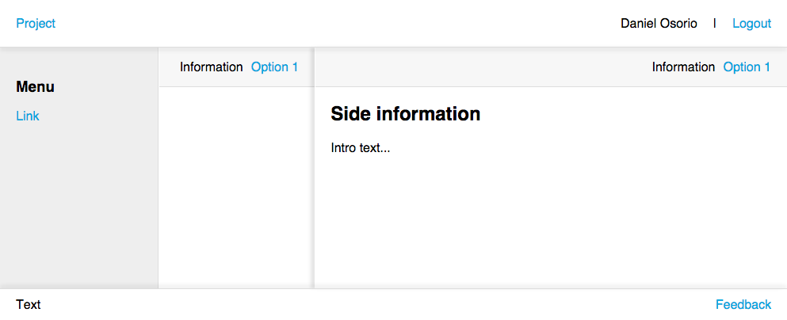

## Layout

Simple and useful html layout for any kind of project.



```shell
# Install
$ npm install

# Watch to start liverealod
$ gulp watch

# Build for production
$ gulp build
```

Copyright (c) 2015 Daniel Osorio
MIT License